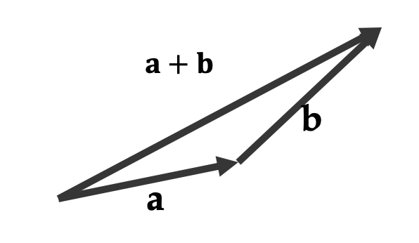
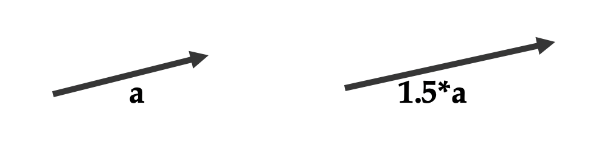
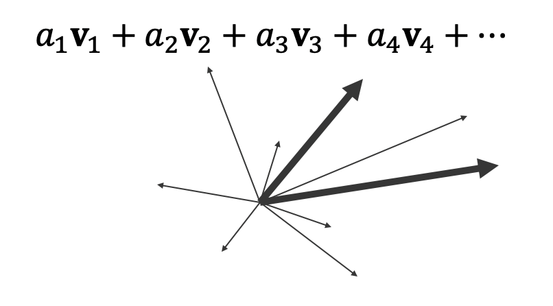
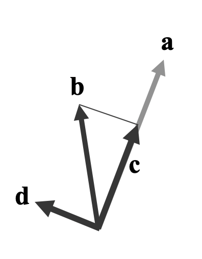
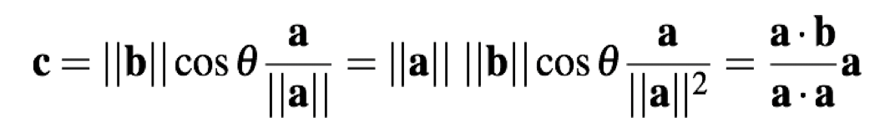

# Linear Algebra

> 세상은 Vector, Scala, Matrix로 표현 가능

## Vectors

### properties

- number array(n개의 실수를 나타내는 표현식) => n개의 **자유도**를 가진다.
- 이를 기하학에 적용하면 3차원 벡터 (선으로 표현 가능)

### operation

##### 1. Addition

> Accumulation of displacement



##### 2. Scalar multiplication (scaling)



##### 3. Linear Combination



> 벡터들의 조합 (scale과 add)

- _a1_ **v1** + _a2_ **v2** + _a3_ **v3** + _a4_ **v4** + ... 식으로 표현가능한 형태
- 직선의 방정식으로 표현 가능

##### 4. vector space

> Set of vector that can be built by linear combinations of the (basis) vector. Vector space spanned by the basis vectors.

- **v** = _a1_ **v1** + _a2_ **v2** => 자유도는 _a1_, *a2*로 2개라서 평면 표현이 가능하다

##### 5. Linearly dependent : 선형적으로 종속적이다

> - vector is a linear combination of the other. In this case the dimensionality of the space spanned by the vectors is smaller than the original vector

##### Example

1. 3*x* + 4*y* = 5, 6*x* + 4*8* = 10

- 즉, ad-bc가 0인 경우, 역행렬이 없는 경우

2. if **v1**, **v2** is zero vector, vector space is zero vector.
3. if **v1**, **v2**의 방향이 같으면, verctor space is 직선이다. 즉 **v1**과 **v2**가 같으면 서로 대치(代置)할 수 있다.

### Combinations

##### 1. Linear Combinations

> _a1_ **v1** + _a2_ **v2** + _a3_ **v3** + _a4_ **v4** + ...

##### 2. Affine Combinations

> _a1_ + _a2_ + _a3_ + _a4_ + _a5_ + ... = 1

##### 3. Convex Combinations

> 0 <= _a1_ ... _a_ **n** <= 1

### Dot product

```
|a|   |d|           |d|
|b| . |e| = [a b c] |e| = ad + be + cf
|c|   |f|           |f|
```

#### 1. 교환법칙 성립

- **a**<sup>T</sup> **b** = **b**<sup>T</sup> **a**
- **a** • **b** = **b** • **a**

#### 2. cosine 관계

> **a** • **b** = ||**a**|| ||**b**|| cosθ

- if dot product is zero, two vectors are perpendicular to each other.
- if dot product is negative, two verctors are directing opposite directions.

### Vector length (Magnitude)

```
     |a|
a  = |b|   ||a|| = sqrt{a^2 + b^2 + c^2} = sqrt(dot(a,a))
     |c| ,
```

### Normalization : 방향만 알고 싶은 경우

> unit vector : a vector with length of 1

- noramlize(**a**) = **a** / ||**a**||

### Projection

> **c** is the projection of **b** onto **a** > 

- **c** length = ||**b**|| cosθ
- **c** direction = **a** of direction = **a**/||**a**||



#### Orthogonal

**d** = **b** - **c** = **b** - (**a** **b** / **a** **a**) **a**
