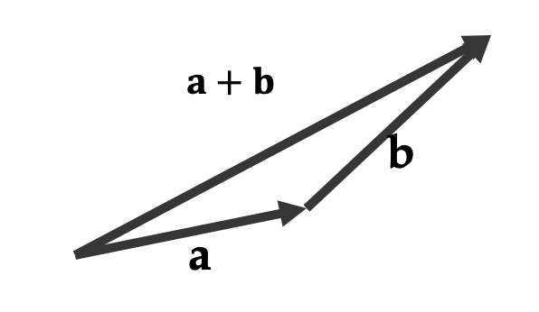

# Linear Transforms

- a transform defined by a matrix
- shear, scaling, rotation and their combinations

## Scaling

```
|s 0 0 0|
|0 s 0 0|
|0 0 s 0|
|0 0 0 s|
```

- uniformly
  **p<sup>'</sup>** = _s_ **I** **p**

## Rotation (Special orthogonal)

```
|cosθ -sinθ|
|sinθ  cosθ|
```

- column vector간의 dot product는 0. 서로 수직이다.
- column vector의 lengt는 1
- basis가 직교 길이하고가 일을 유지하면서 도는 경우
- every rotaion matrix is always orthogonal.

## Shear

> rotaion과 scale의 조합으로 표현 가능


