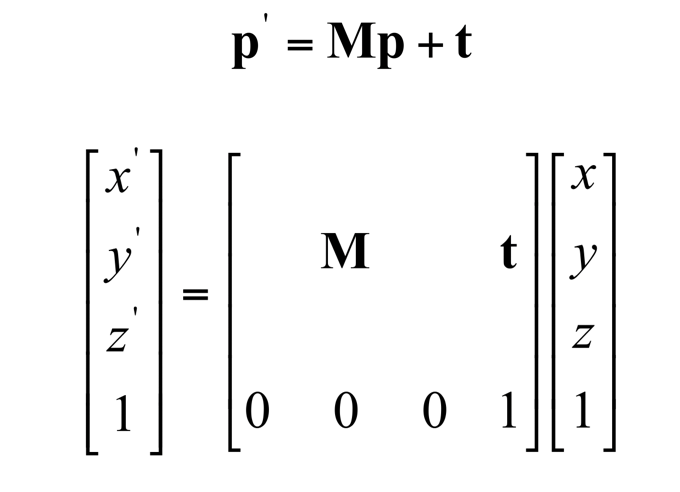

# Homogeneous Transforms

> combining linear transform with translation

- vector + 1 : homogeneous coordinate

## Affine Transformation

- preserve affine combination
- shear, scaling, rotation, translation and their combination
- maps lines to lines
- maps parallel lines to parallel lines
- preserves ratios of distance along a line
- does not preserve absolute distances and angles

## Rigid Transformation

- preserve distance between any two points
- rotation and translation
