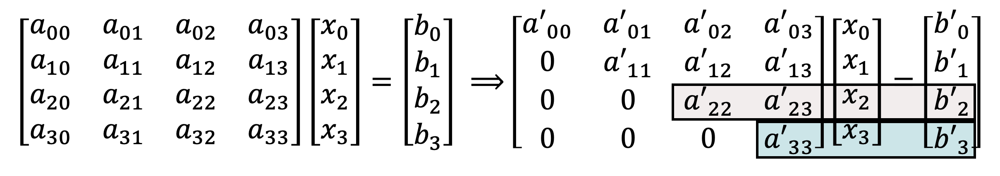

# Solution Methods

- Direct Methods

  - terminate within a finite number of steps
  - end with the exact solution
  - ex) Gauss elimination

- Iterative Methods
  - produce a sequence of approximations which hopefully converge to the solution (수렴과 발산)
  - commonly used with large sparse systems
  - ex) Newton method

## Gauss Elimination 가우스 소거법

- reduce a matrix A to a triangulr matrix
  
- back substitution : 뒤에서부터 대입하면서 푸는 방식
  
- All right-hand sides must be known in advance. but 대부분의 경우는 right-hand side가 시시각각으로 변경된다.

## Interpolation with a polynomial of degree two

