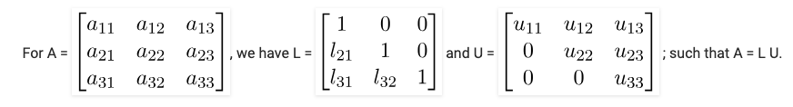

# Solution Methods

- Direct Methods

  - terminate within a finite number of steps
  - end with the exact solution
  - ex) Gauss elimination

- Iterative Methods
  - produce a sequence of approximations which hopefully converge to the solution (수렴과 발산)
  - commonly used with large sparse systems
  - ex) Newton method

## Gauss Elimination 가우스 소거법

- reduce a matrix A to a triangulr matrix
  
- back substitution : 뒤에서부터 대입하면서 푸는 방식
  
- All right-hand sides must be known in advance. but 대부분의 경우는 right-hand side가 시시각각으로 변경된다.

## Interpolation with a polynomial of degree two

## LU Decomposition

> Decompose a matrix **A** as a product of lower and upper triangular matrices

**A** **x** = **c**

1. 가우스 소거법으로 L, U 형태로 변환 => **L** \* **U** **x** = **c**
2. **L** **z** = **c** 에서 **z**를 구한다.
3. **U** **x** = **z** 에서 **x**를 구한다.

- LU decomposition is very efficient with tridiagonal and band matrix
  - O(k2N), where K is the band width

[more LU Deocomposition](https://www.geeksforgeeks.org/l-u-decomposition-system-linear-equations/)

## Cholesky Decomposition

조건를 만족하는 경우

1. symmetric
2. positive definite : vT **A** **v** > 0 for all vectors **v**

**L** **L** = **A** 성립

한계점

- 처음에 positive definite인지 인지하기 어렵다.

## QR Decomposition

> **A = Q R**
>
> - **R** is upper triangular
> - **Q** is orthogonal

**Q QT = I** 성립

- Generally, QR Decomposition is slower than LU decomposition. (벡터의 길이를 계산하는 과정이 존재한다. sqrt가 자주 사용되서 일반적으로 느리다.)

## Jacobi Interation

> Decompose a matrix A into three matrices.
>
> **A x = (I + L + U)x = b**

**x(n+1) = b - Lx(n) - Ux(n)**, It converges if **A** is strictly diagonally dominant.
