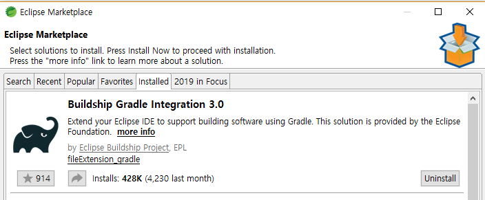
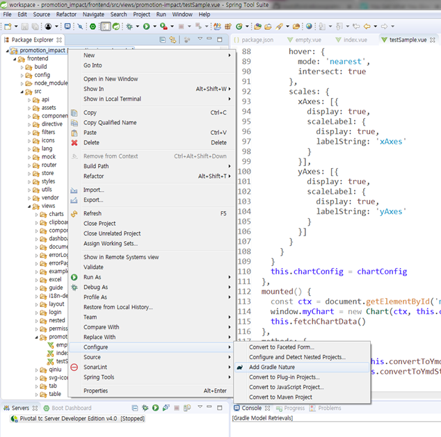
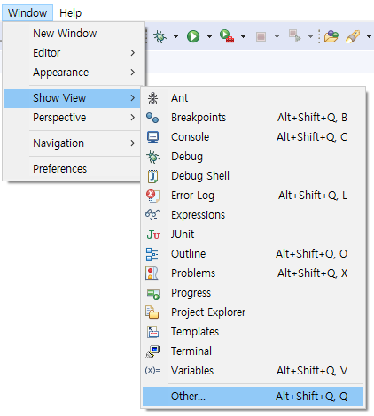
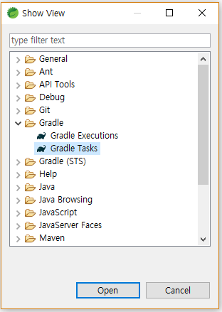
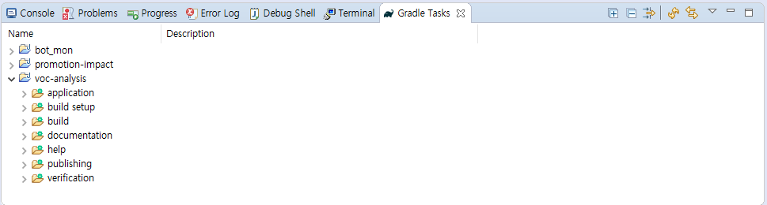

# Gradle with STS (Eclipse)

## Requirements

### 1. JDK 1.8
### 2. [Spring Tool Suite (eclipse)](https://spring.io/tools)
### 3. Eclipse Gradle Plugin

---

## Install

1. Installing Spring Tool Suite

    [Spring Tool Suite](https://spring.io/tools)

2. Plungin Eclipse Gradle Tool

    BuildShip Gradle Integration

    

3. Import General Project

4. Convert General project to Gradle

    Click **Configure > Add Gradle Nature**

    

5. Open Gradle-Tasks View

    - click **Window > Show View > Other**

    
    
    - click **Gradle > Gradle Tasks**

    

6. Run Server

    

---

