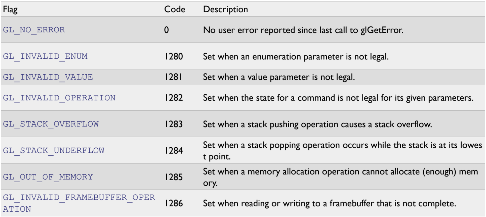

## Debug

### glGetError()

- old version
- 에러가 의심되는 곳에서 호출
- return 값으로 Error Code(int) 반환

#### error code table



### Callback Function

> 특정 오류가 발생하면 실행. We can register a debug callback function that will be executed whenever an error occurs, or other informational message is generated.

1. Create an OpenGL program with a debug context

```c++
glfwWindowHint(GLWF_OPENGL_DEBUG_CONTEXT, GL_TRUE);
```

2. Debug message is enabled by default

3. Enable debug message explicitly

```c++
glEnable(GL_DEBUG_OUTPUT);
```

4. Create a callback function to receive the debug messages

```c++
void debugCallback(GLenum source, GLenum type, GLuint id, GLenum severity, GLsizei length, const GLchar *message, void *userParam)
{
  // ignore non-significant error/warning codes
  if(id == 131169 || id == 131185 || id == 131218 || id == 131204)
    return; std::cout << "---------------" << std::endl;

  std::cout << "Debug message (" << id << "): " << message << std::endl;

  switch (source) {
    case GL_DEBUG_SOURCE_API:
      std::cout << "Source: API"; break;
    case GL_DEBUG_SOURCE_WINDOW_SYSTEM:
      std::cout << "Source: Window System"; break;
    case GL_DEBUG_SOURCE_SHADER_COMPILER:
      std::cout << "Source: Shader Compiler"; break;
    case GL_DEBUG_SOURCE_THIRD_PARTY:
      std::cout << "Source: Third Party"; break;
    case GL_DEBUG_SOURCE_APPLICATION:
      std::cout << "Source: Application"; break;
    case GL_DEBUG_SOURCE_OTHER:
      std::cout << "Source: Other"; break;
  }
  std::cout << std::endl;

  switch (type) {
    case GL_DEBUG_TYPE_ERROR:
      std::cout << "Type: Error"; break;
    case GL_DEBUG_TYPE_DEPRECATED_BEHAVIOR:
      std::cout << "Type: Deprecated Behaviour"; break;
    case GL_DEBUG_TYPE_UNDEFINED_BEHAVIOR:
      std::cout << "Type: Undefined Behaviour"; break;
    case GL_DEBUG_TYPE_PORTABILITY:
      std::cout << "Type: Portability"; break;
    case GL_DEBUG_TYPE_PERFORMANCE:
      std::cout << "Type: Performance"; break;
    case GL_DEBUG_TYPE_MARKER:
      std::cout << "Type: Marker"; break;
    case GL_DEBUG_TYPE_PUSH_GROUP:
      std::cout << "Type: Push Group"; break;
    case GL_DEBUG_TYPE_POP_GROUP:
      std::cout << "Type: Pop Group"; break;
    case GL_DEBUG_TYPE_OTHER:
      std::cout << "Type: Other"; break;
    }
    std::cout << std::endl;

  switch (severity) {
    case GL_DEBUG_SEVERITY_HIGH:
      std::cout << "Severity: high"; break;
    case GL_DEBUG_SEVERITY_MEDIUM:
      std::cout << "Severity: medium"; break;
    case GL_DEBUG_SEVERITY_LOW:
      std::cout << "Severity: low"; break;
    case GL_DEBUG_SEVERITY_NOTIFICATION:
      std::cout << "Severity: notification"; break;
  }
  std::cout << std::endl; std::cout << std::endl;

}
```

5. Register our callback with OpenGL using glDebugMessageCallback

```c++
glDebugMessageCallback(debugCallback, nullptr);
```

6. Enable all messages, all sources, all levels, and all IDs

```c++
glDebugMessageControl(GL_DONT_CARE, GL_DONT_CARE, 0, NULL, GL_TRUE);
```

7. Filter the types of errors

```c++
glDebugMessageControl(GL_DEBUG_SOURCE_API, GL_DEBUG_TYPE_ERROR, GL_DEBUG_SEVERITY_HIGH, 0, nullptr, GL_TRUE);
```
