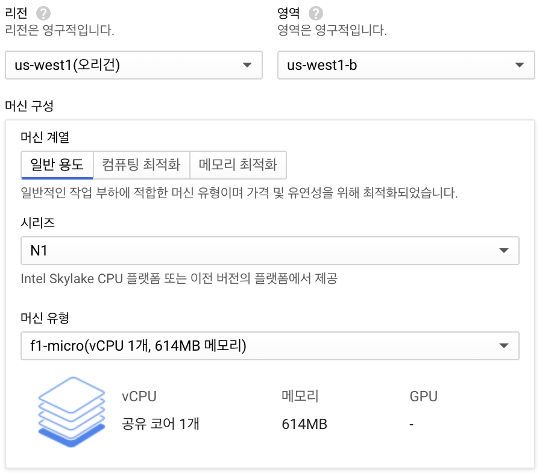

# Compute Engine

- 가상 머신 제품
- aws ec2에 대응되는 제품
- AL/ML 및 데이터 분석과 같은 gcp 서비스와 통합 가능
- confidential VMs : 민감한 정보를 암호화하는 기술
- live migration

## Giude

### Start Linux VM
1. Compute Engine Console에서 VM 인스턴스 만들기
2. 리전 선택
    - 무료 리전 : 오리건, 아이오와, 사우스캐롤라이나
3. 시리즈, 머신 유형
    - 무료 : N1, f1-micro
4. 부팅 디스크
5. 방화벽
    - HTTP 트래픽 허용

### VM에 연결

---
## Reference

https://cloud.google.com/compute

https://cloud.google.com/compute/docs

https://cloud.google.com/compute/vm-instance-pricing#e2_predefined

