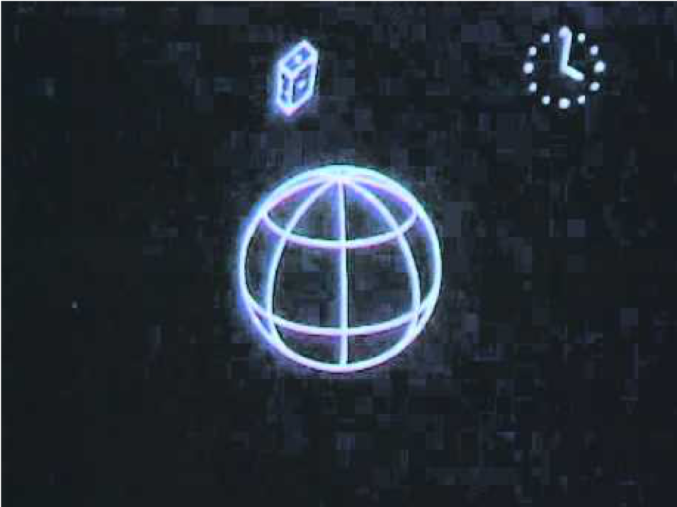
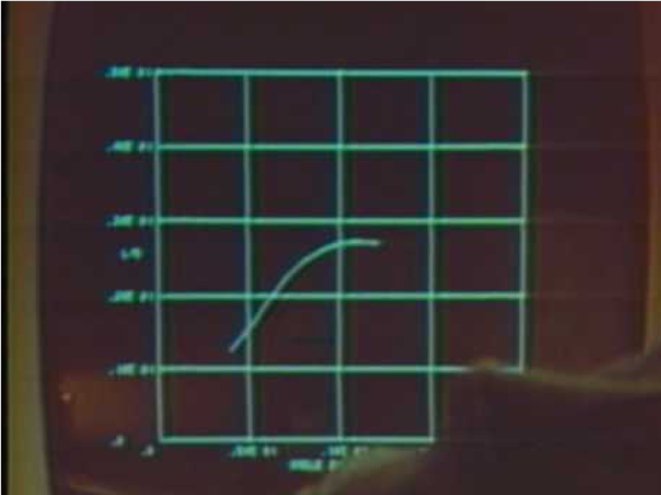

# Digital Image

> 1. artifact that depicts visual perception, such as a photograph or other two-dimensional picture, that resembles a subject and thus provides a depiction of it
> 2. an image is a distributed amplitude of colors.

- Snapshot of light
- Two dimensional form (also retian is 2D)
- simulation real world

## 2D funcion

> f(x,y) = intensity

## Digitization Method

### 1. Rastr Image

- Usually evenly distributed in vertical and horizontal direction
- Pixels are squares in most cases
- JPEG, PNG, GIF ...

### 2. Vector Image

- storing how to draw thing on 2D iamge plane (lines, polygons, circle, curves ...)
- tyoical examples : vector font, data transferred to printer
- SVG, AI ...

## Advantage & Disadvantage

| Advantage               | Disdvantage            |
| ----------------------- | ---------------------- |
| Easy reprodution        | Large Data             |
| Fine Detail             | Limited Resolution     |
| Easy to access a part   | Hard to modify locally |
| Easy to modify globally |                        |
