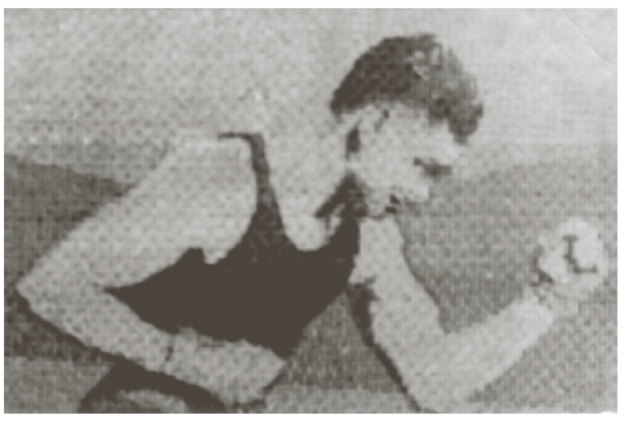
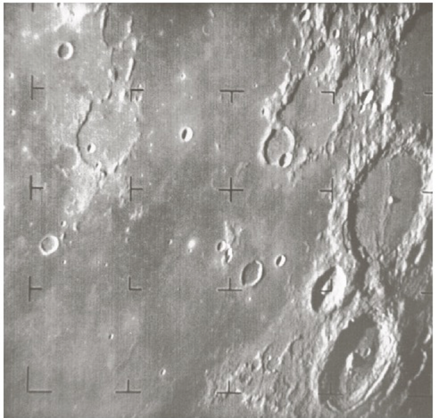
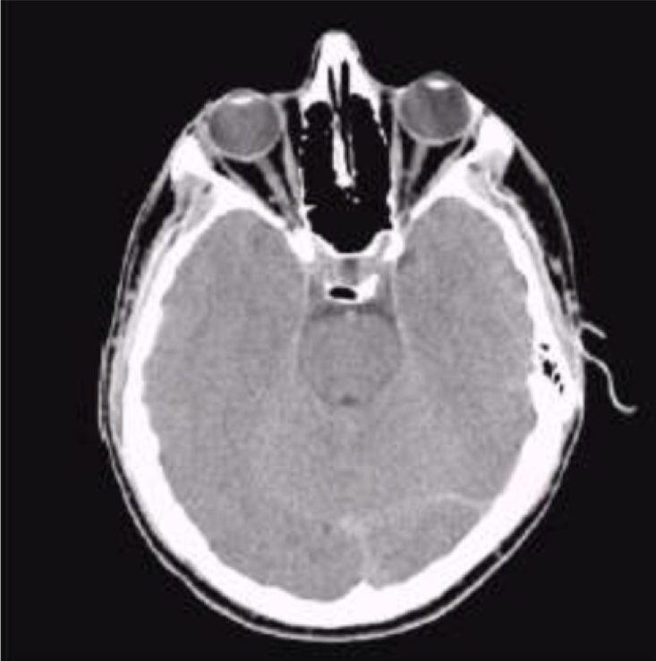

# History of Digital Image

## Telegraph (1921)

### - coded tape by a telegraph printer with special type face.

## First picture of the moon (1960)

### - took by spacecraft ranger, then computer used to improve the quality of image

## Medical apllication (1970)

### - computerized tomography

_ \* tomography : 단층 촬영_
