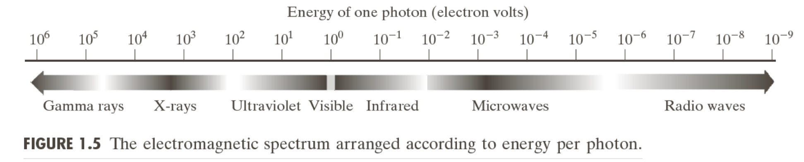
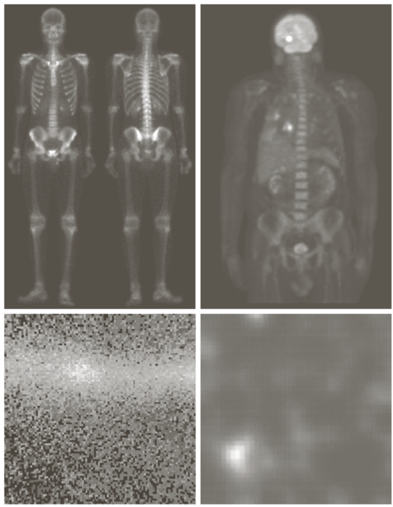
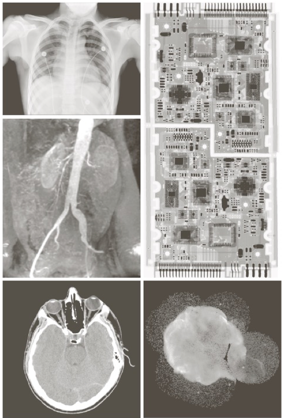
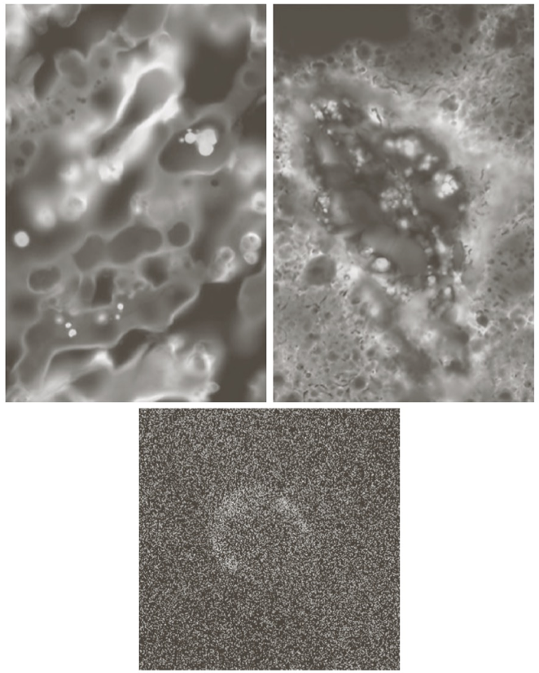
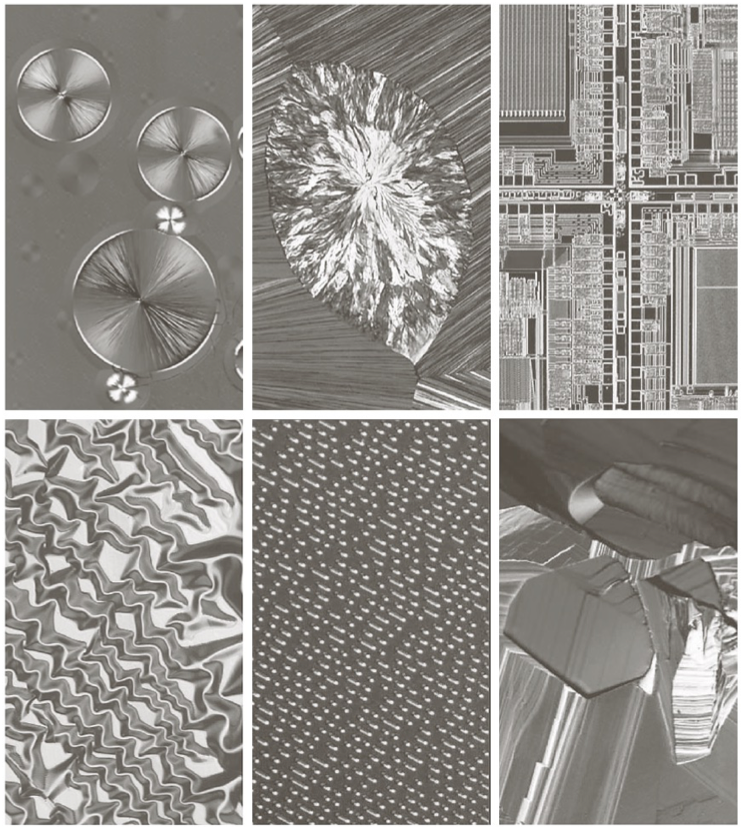
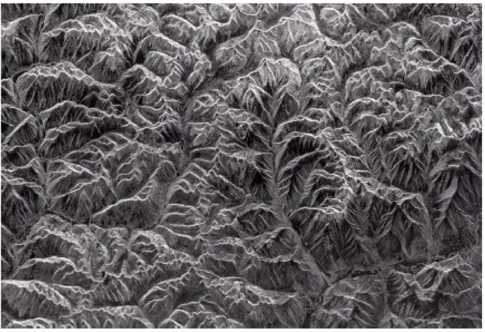
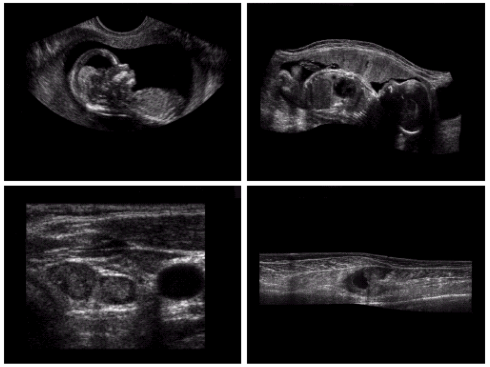

# Invisible Ligth imaging

## Electromagnetic energy spectrum

### Gamma-Ray

### X-Ray

### Ultraviolet

### Visible, infrared

### Microwave

산의 지형을 파악하기위해서 나무, 풀 등을 제거한 사진

## Sound , Ultrasonic wave image

#

_\* electromagnetic : 전자기의_

_\* infrared : 적외선_

_\* radio wave : 전파_

_\* ultrasonic : 초음파_
