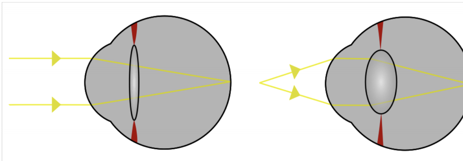
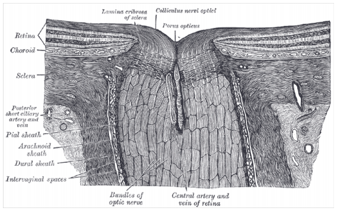
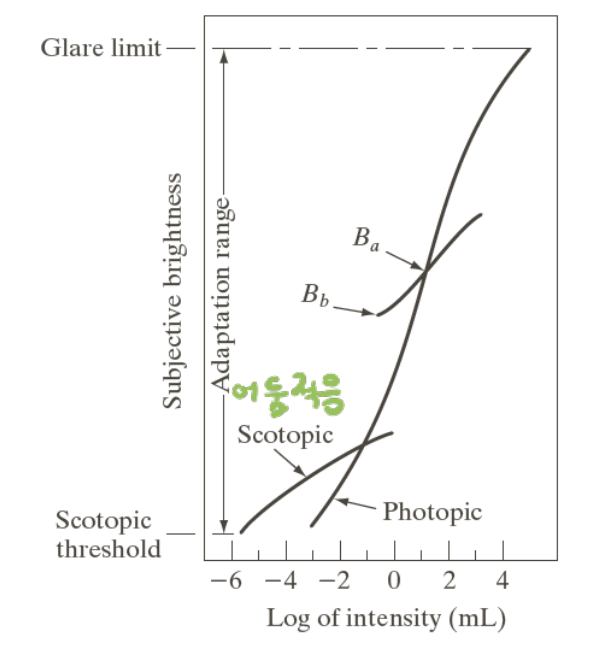
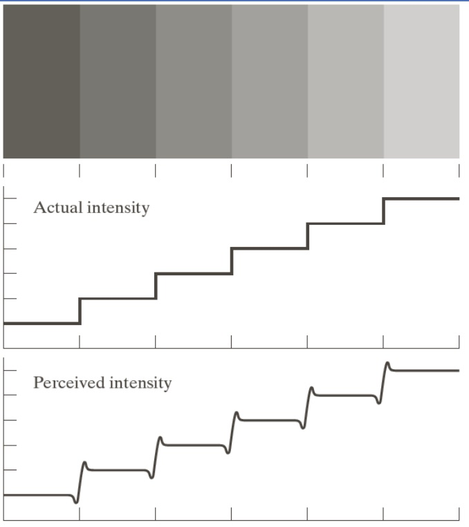
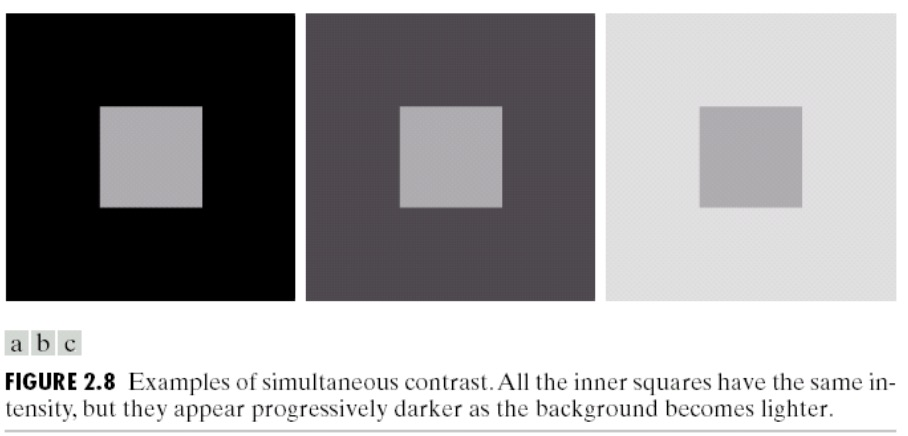
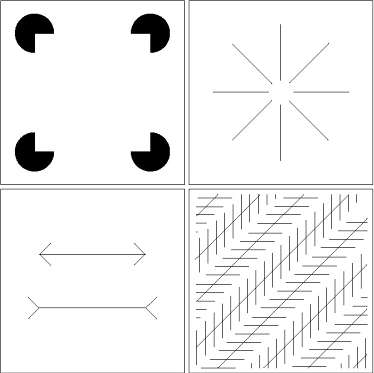
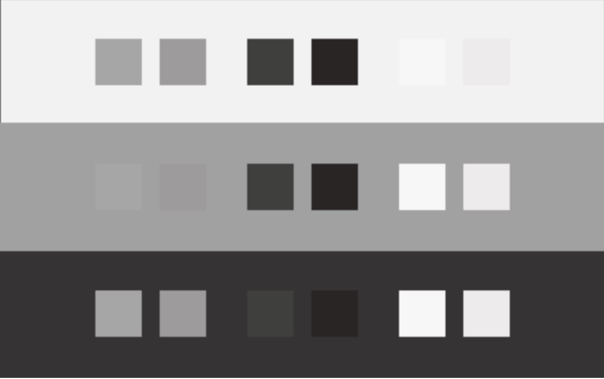
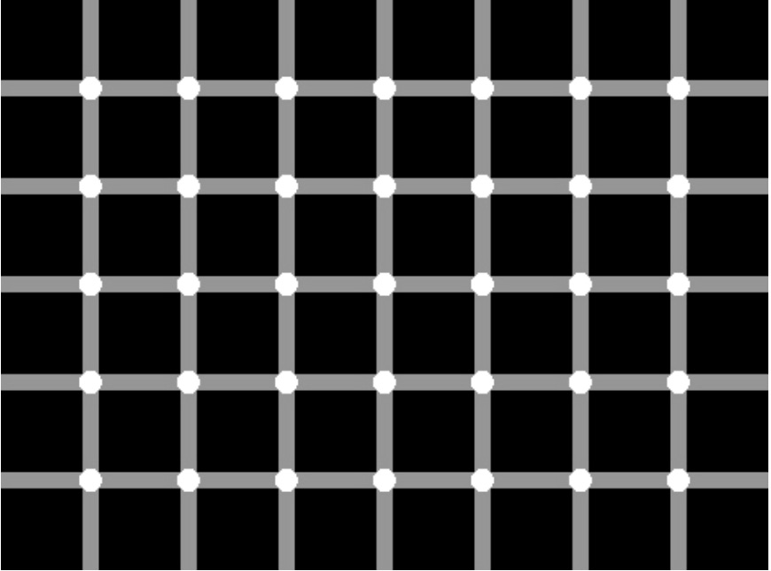
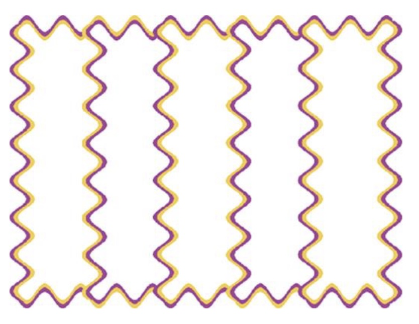

# Human Vision

## Optic Component

1. Cornea(각막)

- Large refraction index
- Act as magnifyung glass
- Refraction error causes
- Aging causes decoloration

2. Iris(홍채)

- Circular structure(괄약근)
- Aoerture stop : Contorolling incoming intensity
- Eye color : melanin conectration
- Iris alone cannot explain the wide range of light intesity of human vision

3. Lens(수정체)

- Fuction of Accommodation: Focusing
- Old eye : hardened lens loosing flexibility

4. Vitreous humors(유리체)

- Fills between lens and retina
- Shape keeping

5. Retina(망막)

- Thin layer
  - optic cells and neurons
  - complicated networks of neuron cells
- Photoreceptor
- Cone : 6~7 millions, color sensing
- Rod : 75~150 millions, scotopic vision(밝기에 반응)

### Cone 추상세포

> color vision, Functions best in brighter light

### Rod 간상세포

> 주변 시각 Functions in less intens light

### Fovea 와(窩)

> Area of retina with high photoreceptor density 정확히 볼 수 있는 곳, Field of view 2˚

### Macula 황막

> Fovea에 너무 강한 빛이 오는 것을 방지

### Optic Disc 맹점

> Nerve Head, Causes blind spot

## Brightness Adaptation & Discrimination

1. 주관적인 밝기는 로그 함수 형식을 취한다.
2. iris size, rod-cone transition, brain processing이 밝기 적응도에 영향을 미친다.
3. 밝기가 증가할 수록 밝기 차이를 인식하는 정도가 증가한다.

## Optical Illusion

### Mach-band effect

### Simultaneous Contrast

### Well-known optical illusion

### Crispening

### Structural Effect

### Water Illusion

