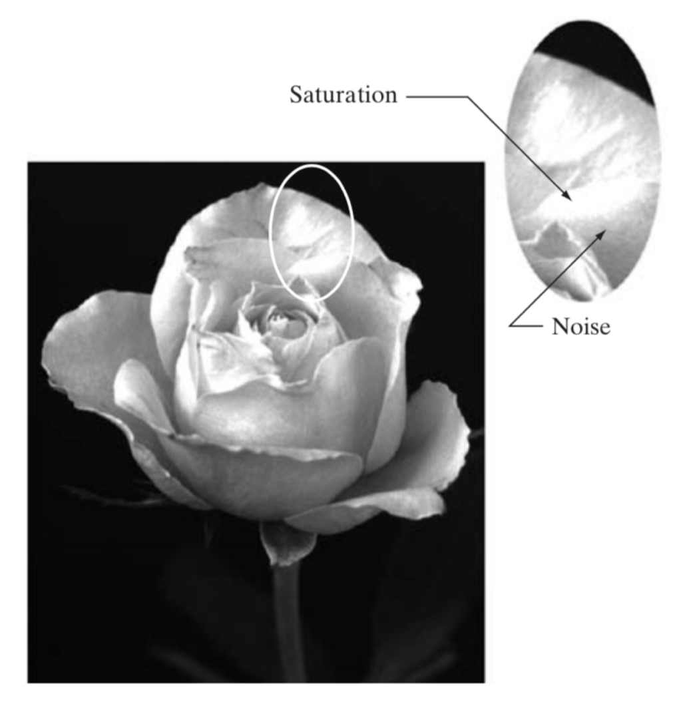
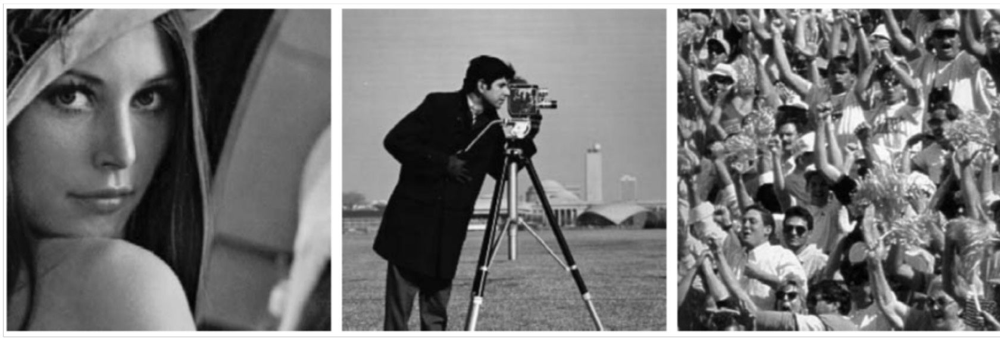
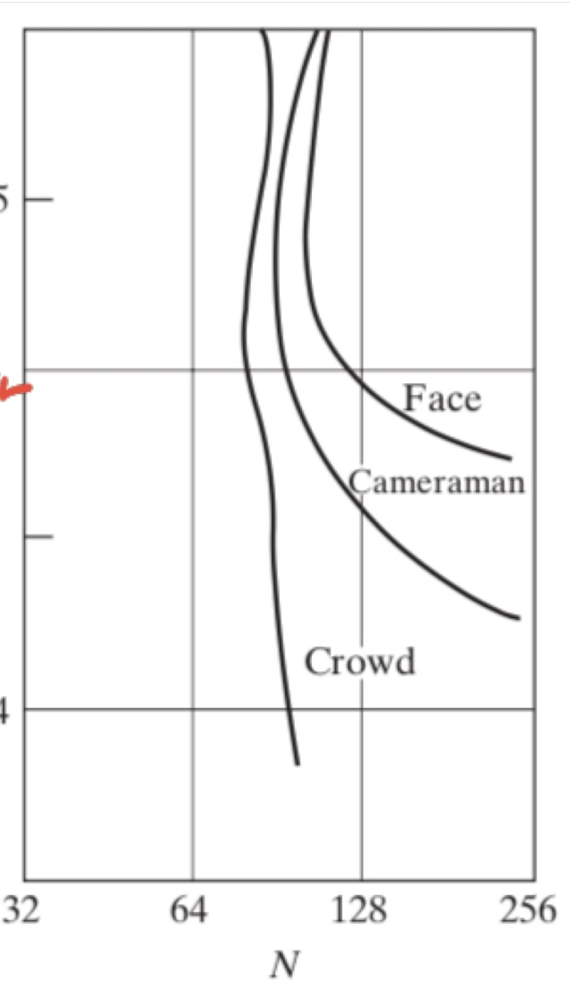
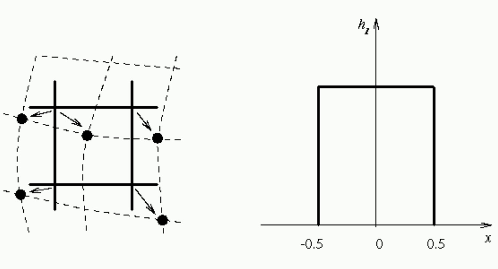
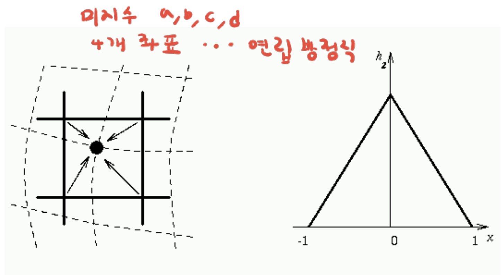
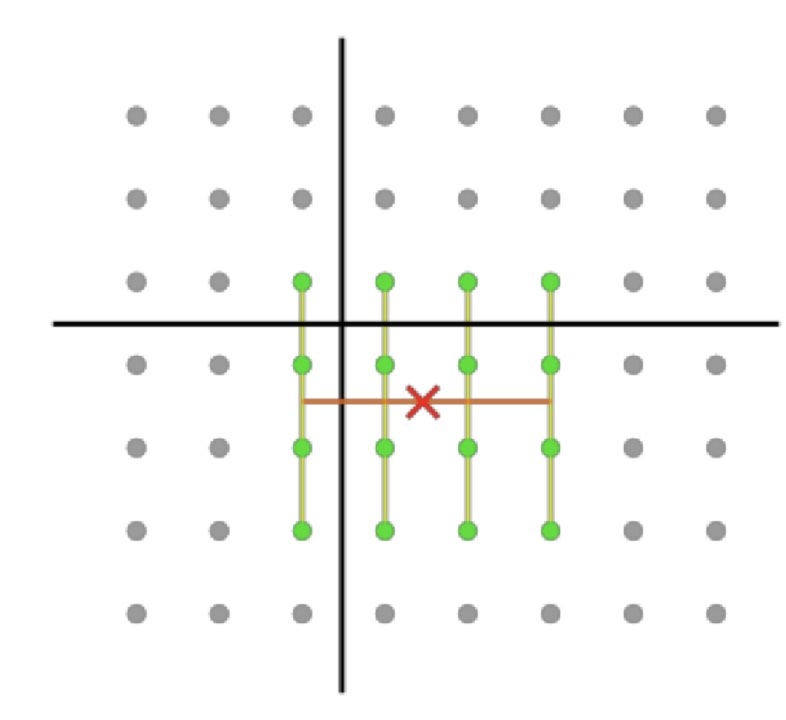

# Image Aquisition

CCD array : 카메라dp 2D Sensor Array가 존재

### Reflectance Examples

| Object                | Reflectance |
| --------------------- | ----------- |
| black velvet          | 0.01        |
| stainless stell       | 0.65        |
| flat-white wall paint | 0.80        |
| silver-plated metal   | 0.90        |
| snow                  | 0.93        |

## Sampling

> 연속 함수를 특정 단위씩 분할하여 이산 데이터로 수집

- Describing a continuous function with a sequence of numbers
- In image, spatially sampling
- Breaking image in x- and y- direction into a small set of pixels
- Representing image with the pixel values

## Quantization

> sampling value를 수치로 변환하는 과정

- Representing a sample value with a number of a limited precision
- In image, a pixel amplitude is stored with (usually) integer number with a
  limited range (usually 0-255)

### Saturaion (Quantization Noise)

> Quantization의 최대,최소값이 고정되어서 그 이상,이하의 값들은 동일하게 나타는 현상
> 

## Resolution

1. Spatial resolution

- A measure of the smallest discernible detail in an image
- Stated with line pairs per unit distance, dots (pixels) per unit distance,
  dots per inch (dpi)
- 인간은 300dpi까지 식별 가능

2. intensity resolution

- The smallest discernible change in intensity level
- Stated with 8 bits, 12 bits, 16 bits, etc.

### Isoreference Curves

> Gradient가 많은 사진일 수록 Resolution이 높아야 사진의 만족도가 높아진다.

|                                       |                                       |
| ------------------------------------- | ------------------------------------- |
|  |  |

## Image Interpolation

> Estimating unknown values using known data

> Making image with higher resolution from values between pixels

1. Nearest neighbor interpolation

_v_(x,y) = f (round(x), round(y)

2. Bilinear interpolation

_v_(x,y) = ax + by + cxy + d

3. Biquadratic inrerpolation

_v_(x,y) = &Sigma;3i=0 &Sigma;3j=0 aij xi yj
