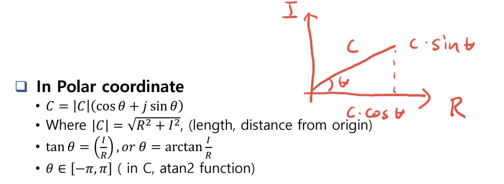
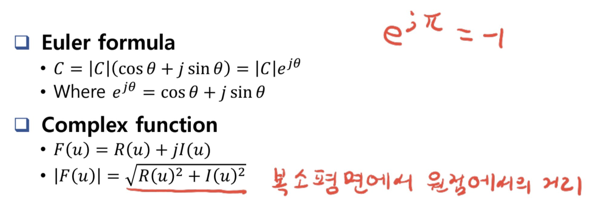
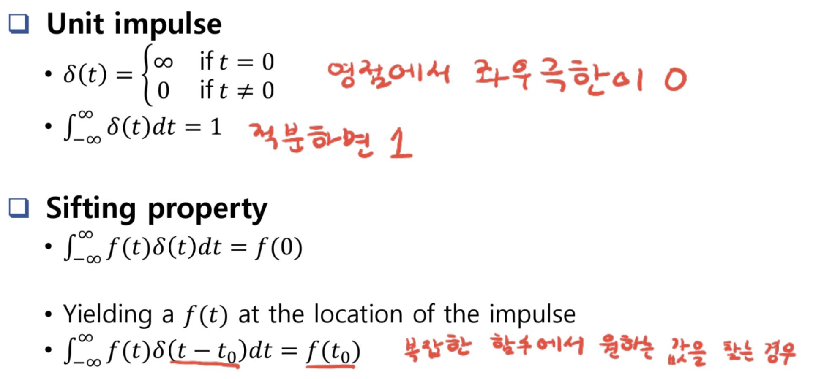
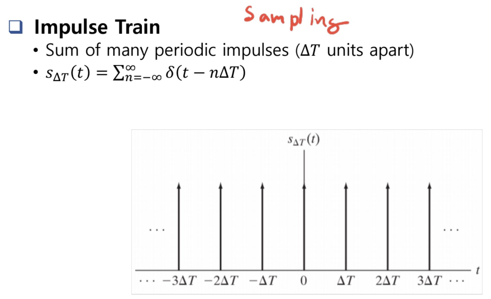

# Fourier Series

> Any periodic function can be expressed as sum of sines and/or cosines off different frequencies, each multiplied by a different coefficient

- finite none-periodic function은 fourier transform으로 변환 가능
- C = R+_j**I**_ (R:real part , j:sqrt(-1) ,**I**: imaginary part)

## Preliminary Concepts

## Impulses and Their Sifting Property

## Image Transforms

spatial domain f(x,y)
Transform => T(u,v)
Operation => R[T(u,v)]
Inverse transform => spatial domain g(x,y)
