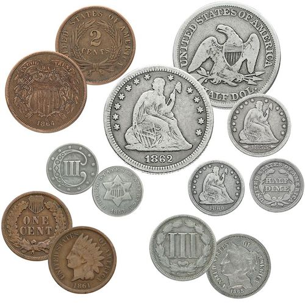
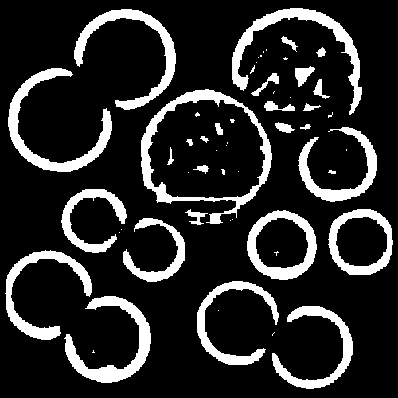

# Image Recognition : Coin Finder

1. 동전 사진의 source 파일에서 원형의 edge를 찾는다.
2. 원형의 edge를 더 원형에 가깝게 closing

## Sample 1

| Source                          | Closing                               | Out                           |
| ------------------------------- | ------------------------------------- | ----------------------------- |
|  |  |  |

## Sample 2

| Source                          | Closing                               | Out                           |
| ------------------------------- | ------------------------------------- | ----------------------------- |
|  |  |  |
