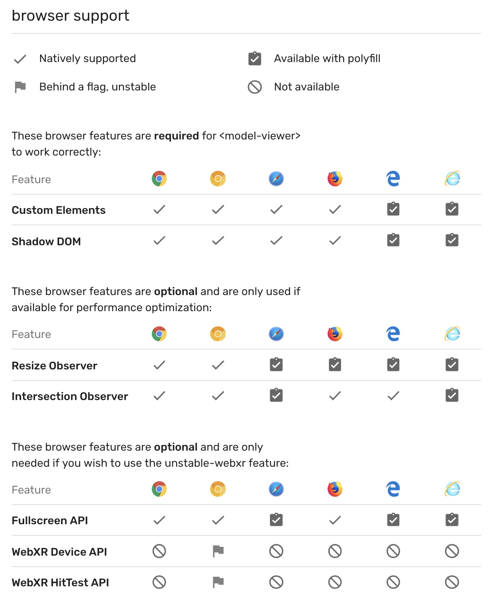

# model-viewer

[Chrome Developer Doc](https://developers.google.com/web/updates/2019/02/model-viewer)

2019.02월 chrome에서 3d model viewer를 web component로 제공한다.

추가적으로 구글에서 지속적으로 개발하고 있다고 한다. 최신 정보를 위해서
[git repo](https://github.com/GoogleWebComponents/model-viewer)를 추가합니다.

### usage

```html
<model-viewer
  src="assets/Astronaut.gltf"
  alt="A 3D model of an astronaut"
></model-viewer>
```

[detail usage](https://googlewebcomponents.github.io/model-viewer/index.html)

### Browser support



lazy-loading, camera control, background-color 등 다양한 기능을 제공합니다.
