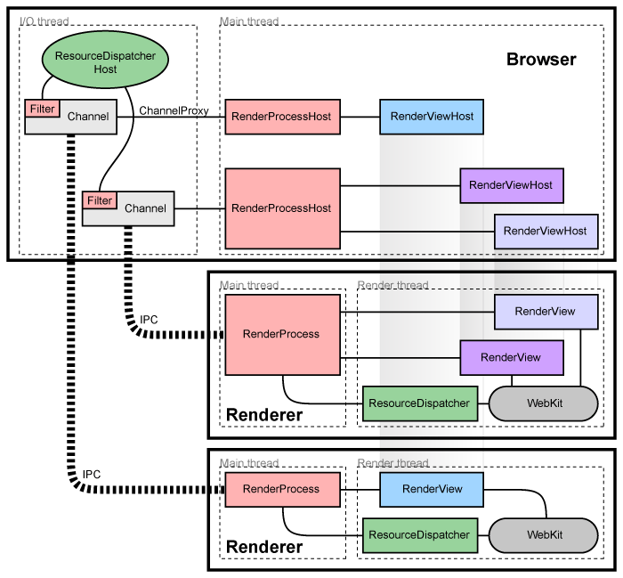

# High Level Architecture

> describes Chromium's high-level architecture

## Architectural overview

Chromium은 rendering engine의 안정성을 위해서 tab 별로 proccess를 나누었다. rendering engine process이 다른 시스템에 접근하는 것을 제한했다.

memory protection and access control brought to operating systems의 이점을 가진다.

1. browser process

- main process that runs the UI and manages tab and plugin processes

2. render processes , renderers

- the tab-specific processes
- [Blink open-source layout engine](https://www.chromium.org/blink) for interpreting and laying out HTML

### Managing render processes

**Browser** 와 **Renderer**는 [Chromium's IPC system](https://www.chromium.org/developers/design-documents/inter-process-communication)로 통신한다.

1. Global RenderProcess (**Browser**)

- manages communication with the parent browser process and maintains global state

2. RenderProcessHost (**Renderer**)

- exist each render process
- manages browser state and communication for the renderer

### Managing views (Render Process)

Each render process has one or more **RenderView** objects, managed by the **RenderProcess**, which correspond to tabs of content. The corresponding **RenderProcessHost** maintains a **RenderViewHost** corresponding to each view in the renderer. Each view is given a view ID that is used to differentiate multiple views in the same renderer. These IDs are unique inside one renderer but not within the browser, so identifying a view requires a **RenderProcessHost** and a view ID. Communication from the browser to a specific tab of content is done through these RenderViewHost objects, which know how to send messages through their **RenderProcessHost** to the **RenderProcess** and on to the **RenderView**.

## Component and Interface

### In the render process:

- The RenderProcess handles IPC with the corresponding RenderProcessHost in the browser. There is exactly one RenderProcess object per render process. This is how all browser ↔ renderer communication happens.
- The RenderView object communicates with its corresponding RenderViewHost in the browser process (via the RenderProcess), and our WebKit embedding layer. This object represents the contents of one web page in a tab or popup window

### In the browser process:

- The Browser object represents a top-level browser window.
  The RenderProcessHost object represents the browser side of a single browser ↔ renderer IPC connection. There is one RenderProcessHost in the browser process for each render process.
- The RenderViewHost object encapsulates communication with the remote RenderView, and RenderWidgetHost handles the input and painting for RenderWidget in the browser.

[more detail: How Chromium displays web pages](https://www.chromium.org/developers/design-documents/displaying-a-web-page-in-chrome)

[참고문서](https://www.chromium.org/developers/design-documents/multi-process-architecture)
