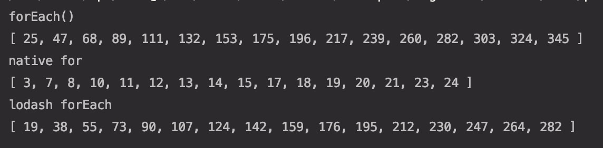
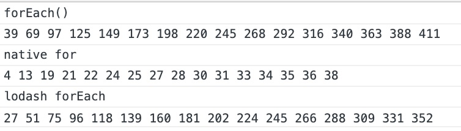

# Loop 성능 테스트

> 일반적으로 js에서 loop를 실행하기 위해서는 3가지 방법이있다. 각각을 node, browser 황경에서 성능을 테스트 해본다.

```js
const arr = new Array(2000000);
```

1. forEach

```js
arr.forEach(ele => {
  // TODO
});
```

2. native for

```js
for (let i = 0; i < arr.length; i++) {
  const ele = arr[i];
  // TODO
}
```

3. lodash forEach

```js
_.forEach(arr, ele => {
  // TODO
});
```

## 테스트 방법

1. 16 length의 array를 생성하고 임의 값을 할당한다.

```js
const res = new Array(16);
res.fill(1);
```

2. 2,000,000 length의 array를 생성하고 임의 값을 할당한다.

```js
const arr = new Array(2000000);
arr.fill(5);
```

3. *1번의 array*안에 *2번의 array*가 들어있는 이중 반복문을 구조를 만들고 *2번 array*의 반복문이 끝난 경우에 걸린 시간을 empty array에 push()한다.

```js
const startTime1 = new Date();
const result1 = [];

res.forEach(r => {
  arr.forEach(ele => {
    ele + ele;
  });
  result1.push(new Date() - startTime1);
});
```

## Node

node version : v8.11.3

### 실행 결과



### code

```js
const _ = require('lodash');

const res = new Array(16);

res.fill(1);

const arr = new Array(2000000);

arr.fill(5);

const startTime1 = new Date();
const result1 = [];

res.forEach(r => {
  arr.forEach(ele => {
    ele + ele;
  });
  result1.push(new Date() - startTime1);
});
console.log(result1);

const startTime2 = new Date();
const result2 = [];

for (let i = 0; i < res.length; i++) {
  for (let j = 0; j < arr.length; j++) {
    arr[j] + arr[j];
  }

  result2.push(new Date() - startTime2);
}

console.log(result2);

const startTime3 = new Date();
const result3 = [];

_.forEach(res, r => {
  _.forEach(arr, ele => {
    ele + ele;
  });
  result3.push(new Date() - startTime3);
});

console.log(result3);
```

## Browser

chrome : Version 74.0.3729.169 (Official Build) (64-bit)

### 실행 결과



### code

```js
const res = new Array(16);

res.fill(1);

const arr = new Array(2000000);

arr.fill(5);

const startTime1 = new Date();
const result1 = [];

res.forEach(r => {
  arr.forEach(ele => {
    ele + ele;
  });
  result1.push(new Date() - startTime1);
});
console.log('forEach()');
console.log(result1.join(' '));

const startTime2 = new Date();
const result2 = [];

for (let i = 0; i < res.length; i++) {
  for (let j = 0; j < arr.length; j++) {
    arr[j] + arr[j];
  }

  result2.push(new Date() - startTime2);
}

console.log('native for');
console.log(result2.join(' '));

const startTime3 = new Date();
const result3 = [];

_.forEach(res, r => {
  _.forEach(arr, ele => {
    ele + ele;
  });
  result3.push(new Date() - startTime3);
});

console.log('lodash forEach');
console.log(result3.join(' '));
```

## 결과

1. native for가 압도적으로 빠르다. (그 다음으로 lodash forEach 순이다.)

> 아무래도 forEach()는 Callback Function을 매번 실행한다. function을 만들기 위해서 stack에 올려야하고 function을 매번 실행하기 위해서는 resource가 크다. 또한 forEach()는 parameter 에러 처리 등 다른 연산이 들어가있다.
>
> 반면에 native for는 index를 증가시키면서 바로바로 array의 값에 접근한다.

2. 16번 2,000,000번의 array의 element에 접근할 때, native for의 연산 시간이 급격하게 줄어드는 것을 볼 수 있다.

> cache hit일 발생하기 때문이다. locality
> forEach function을 실행하기 위해서는 indexing 외에도 다양한 연산들이 발생하고 있다. 이 연산들이 locality에 영향을 주는 것이라고 판단한다.
