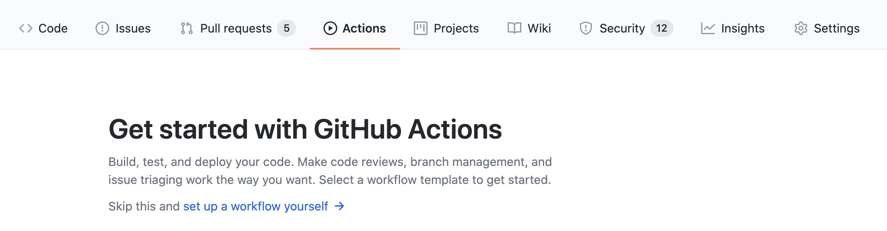

# Getting Started

## Create Sample Actions

    github actions는 .yml를 통해서 만들어진다.
    .yml 파일 위치는 directory에 .github/workflows/###.yml

    
    github actions page에서 'set up a workflow yourself'를 클릭하면 actions를 만들 수 있다.
    
