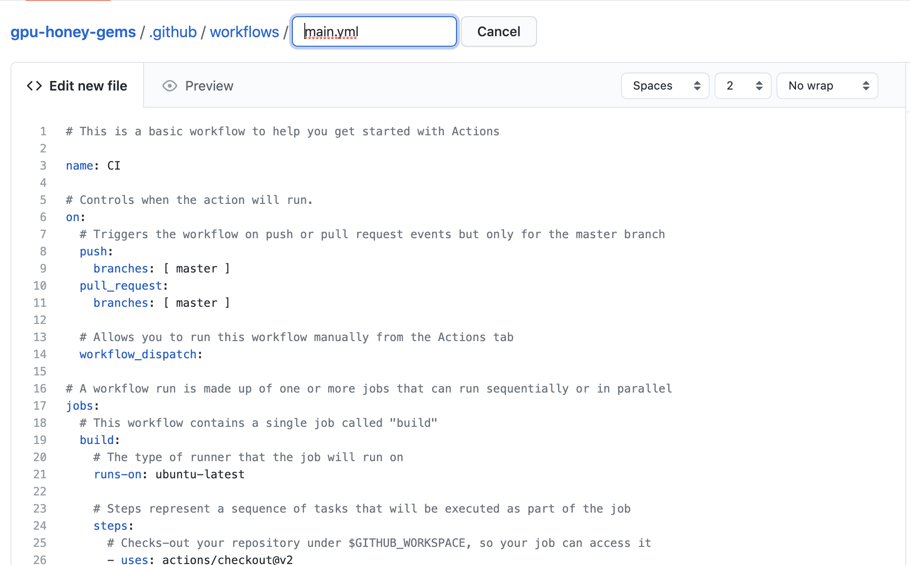

# Getting Started

## Create .yml

    github actions는 .yml를 통해서 만들어진다.
    .yml 파일 위치는 directory에 .github/workflows/###.yml


    
    github actions page에서 'set up a workflow yourself'를 클릭하면 actions를 만들 수 있다.
    


---
## Basic Actions

``` yml
# This is a basic workflow to help you get started with Actions

name: CI

# Controls when the action will run. 
on:
  # Triggers the workflow on push or pull request events but only for the master branch
  push:
    branches: [ master ]
  pull_request:
    branches: [ master ]

  # Allows you to run this workflow manually from the Actions tab
  workflow_dispatch:

# A workflow run is made up of one or more jobs that can run sequentially or in parallel
jobs:
  # This workflow contains a single job called "build"
  build:
    # The type of runner that the job will run on
    runs-on: ubuntu-latest

    # Steps represent a sequence of tasks that will be executed as part of the job
    steps:
      # Checks-out your repository under $GITHUB_WORKSPACE, so your job can access it
      - uses: actions/checkout@v2

      # Runs a single command using the runners shell
      - name: Run a one-line script
        run: echo Hello, world!

      # Runs a set of commands using the runners shell
      - name: Run a multi-line script
        run: |
          echo Add other actions to build,
          echo test, and deploy your project.

```